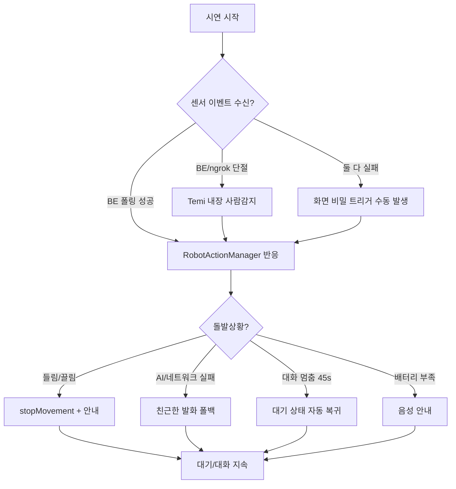

# 시연 방어적 예외처리 지침 (Temi SDK 1.131.4)

> 목적: 센서/네트워크/음성 장애가 나도 **앱이 멈추지 않고** 3~5분 시연이 끊기지 않게 한다.
> 범위: 상용이 아니라 **데모용**. 무거운 production 구조(Room/WorkManager 오프라인-퍼스트 등)는 "선택"으로만 두고, FE 의존성 버전은 바꾸지 않는다.

---

## 0. 현재 구현 상태 (한눈에)

| 영역 | 상태 | 위치 |
|---|---|---|
| 내장 사람감지 백업(백엔드 죽어도 반응) | ✅ 구현 | `RobotResilienceManager` |
| 들림/끌림 → 즉시 정지 + 안내 | ✅ 구현 | `RobotResilienceManager` |
| 배터리 부족 음성 안내 | ✅ 구현 | `RobotResilienceManager` |
| AI/네트워크 실패 → 친근한 발화로 대화 지속 | ✅ 구현 | `MainActivity.answerWithAi` |
| 대화 멈춤(STT/TTS 무응답) → 자동 대기 복귀 | ✅ 구현 | `MainActivity` 워치독(45s) |
| 센서 폴링 실패 → 조용히 재시도 | ✅ 구현 | `SensorEventPoller` |
| HW 전송이 카메라 콜백 안 막음 | ✅ 구현 | `backend_bridge`(백그라운드), `camera_processor`(3s throttle) |
| 키오스크/톱바/wakeup 제어 | ✅ 구현 | `MainActivity`, Manifest `UI_MODE=4` |
| 화면 비밀 트리거(수동 장애 유발) | ✅ 구현 | `MainActivity` 길게누르기 |
| 오프라인-퍼스트 DB/WorkManager 동기화 | ⛔ 데모 범위 밖(선택) | — |

---

## 1. SDK API 실존 대조 (1.131.4 소스 기준)

지침에 등장한 API를 **실제 SDK와 대조**했다. 아래 "실존"은 그대로 써도 되고, "없음"은 쓰면 컴파일이 깨진다.

| API | 1.131.4 | 비고 |
|---|---|---|
| `requestToBeKioskApp()` | ✅ 실존 | |
| `setKioskModeOn(boolean)` | ✅ 실존 | 지침의 `setKioskMode(true)`가 아니라 `setKioskModeOn(true)` |
| `isSelectedKioskApp(): Boolean` | ✅ 실존 | 키오스크 등록 여부 확인 |
| `toggleWakeup(boolean)` | ✅ 실존 | `true`=기본 "Hey temi" **차단** |
| `wakeup()` | ✅ 실존 | 강제 깨우기 |
| `hideTopBar()` / `showTopBar()` | ✅ 실존 | |
| `speak(TtsRequest)` | ✅ 실존 | |
| `setTtsService(ITtsService?)` | ✅ 실존 | 대체 TTS 엔진 |
| `startDefaultNlu(String)` | ✅ 실존 | 클라우드 NLU 실패 시 내장 NLU 폴백 |
| `stopMovement()` | ✅ 실존 | 비상 정지 |
| `goTo(String)` | ✅ 실존 | 예: `goTo("home base")` 충전 복귀 |
| `setDetectionModeOn(boolean, float)` | ✅ 실존 | 내장 사람감지 ON |
| `showNormalNotification(NormalNotification)` | ✅ 실존 | 화면 알림 |
| `showAlertNotification(AlertNotification, ...)` | ✅ 실존 | 경고 알림 |
| `restart()` | ✅ 실존 | 로봇 리부트(최후 수단) |
| `isReady` (val) | ✅ 실존 | 초기화/준비 상태 |
| `onStart(ActivityInfo)` | ✅ 실존 | 지침의 `onStart(getComponentName(), this)` 아님 |
| `OnRobotLifted/Drag/Battery/DetectionStateChangedListener` | ✅ 실존 | 내장 장애/감지 콜백 |
| `lidarScan()` | ⛔ 없음 | 지침에 "가정용"으로 표기됨. LiDAR 원시 스캔 공개 API 없음 |

> 결론: 지침의 거의 모든 핵심 API가 실제로 존재한다. 단 `lidarScan()` 같은 가정용 호출은 쓰지 말 것.

---

## 2. 센서별 장애 → 폴백 (요약)

| 센서 | 탐지 | 폴백(데모) |
|---|---|---|
| 내장 카메라 사람감지 | `OnDetectionStateChangedListener` | 백엔드/HW 죽어도 이걸로 아이 접근 반응 |
| 외장 ToF(KF_HW) | BE `/api/sensor-events` 폴링 | 끊기면 내장 감지로 대체 |
| 들림/끌림 | `OnRobotLifted/DragStateChanged` | 즉시 `stopMovement()` + 안내 |
| 배터리 | `OnBatteryStatusChanged` | 음성 안내(충전 복귀는 기본 OFF) |
| 음성/STT | `VoiceInputManager` onError | 대기 복귀, 화면 터치/비밀 트리거로 대체 |
| AI/NLU | 콜백 onError | 친근한 발화 폴백 (선택: `startDefaultNlu`) |

> **데모 안전 원칙**: 자율 주행(`beWithMe`/`goTo`)은 기본 비활성. 정지(`stopMovement`)·발화·고개(`tiltAngle`)만 쓴다.

---

## 3. 네트워크/서버 단절 (데모 수준)

데모에서는 무거운 오프라인-퍼스트 대신 **"조용한 재시도 + 친근한 폴백"** 로 충분하다.
- `SensorEventPoller`: 폴링 실패는 무시하고 2초 뒤 재시도(앱 영향 0).
- `RetrofitClient`: 10s connect / 20s read 타임아웃 → 무한 대기 방지.
- AI 실패: 원시 에러 대신 "미안해, 잠시 뒤 다시 물어봐 줄래?" 발화 후 대화 지속.
- (선택, 데모 범위 밖) Room 캐시 + WorkManager 백오프 재시도 + ConnectivityManager 오프라인 배지.

---

## 4. 위험 매트릭스

| 위험 | 가능성 | 영향 | 우선 | 완화(현 구현) |
|---|---|---|---|---|
| 앱 크래시 | 낮 | 높 | 1 | 전 구간 try/catch, SDK 호출 가드 |
| 백엔드/ngrok 단절 | 높 | 중 | 1 | 내장 사람감지 백업 + 비밀 트리거 + 폴러 무한 재시도 |
| AI/NLU 실패 | 중 | 중 | 2 | 친근한 발화 폴백 |
| 로봇 들림/끌림 | 중 | 중 | 2 | 즉시 정지 + 안내 |
| 대화 멈춤 | 중 | 중 | 2 | 45초 워치독 → 대기 복귀 |
| 키오스크 탈출 | 낮 | 높 | 2 | onResume마다 `setKioskModeOn(true)` 재확정 |
| 배터리 방전 | 낮 | 중 | 3 | 사전 충전 점검 + 부족 시 음성 안내 |

---

## 5. 시연 사전 점검 체크리스트

- [ ] 로봇 `isReady` true, 배터리 > 30%
- [ ] Wi-Fi 연결, `https://<ngrok도메인>/api/health` → `{"status":"ok"}`
- [ ] BE `bootRun` 로그에 `[ngrok] 공개 URL` 표시
- [ ] 호출어 "친구야" 인식 + TTS 발화 정상
- [ ] 상단바 숨김(UI_MODE=4) + 키오스크 ON
- [ ] 마이크 권한 허용됨
- [ ] **장애 리허설**: ngrok 끊고 → 내장 사람감지/비밀 트리거로 반응 확인
- [ ] **장애 리허설**: 로봇 살짝 들어 정지+안내 확인

---

## 6. 시연 장애 대응 흐름도

---

## 7. 추가 권장(선택, 데모 후 확장용)

- `isSelectedKioskApp()`로 키오스크 등록 실패 시 안내, `restart()`는 최후 수단.
- AI 완전 불통 시 `startDefaultNlu(text)`로 Temi 내장 응답 폴백(단, 응답 톤/언어가 달라질 수 있어 데모 기본은 OFF).
- `showAlertNotification`/`showNormalNotification`으로 운영자용 상태 알림.
- 권한 추가가 필요해지면 `ACCESS_NETWORK_STATE`(연결 감지), `WAKE_LOCK`(화면 유지) — 현재는 `FLAG_KEEP_SCREEN_ON`으로 대체 중.

> 본 문서는 지침 원안을 1.131.4 실제 SDK와 대조해 정리한 것이다. 데모 범위에서 바로 쓸 수 있는 항목만 ✅로 표시했다.
